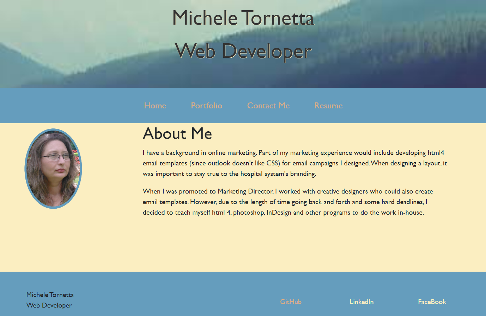

# WebDev - React Portfolio

## Table of Contents 
  * [User Story](#user-story)
  * [Acceptance Criteria](#acceptance-criteria)
  * [Mock Up](#mock-up)
  * [License](#license)
  * [Credits](#Credits)
  * [Deployed Link](#deployed-link)

## User Story

As a web developer, I create web applications that are user friendly, follow best practices, and are accessible.  Each application should be writtin in such a way that future changes are easy to do.

## Accpetance Criteria

When an employer visits my sight, then that employer will learn a little about me and have the ability to see my work.

When an empoloyer visits my sight, they will be preseneted with a single page with the About Me being presented first.

Then the employer can click on the Projects link which and be able to see the Portfolio section with the ability to open each project and visit the github repository for that same project.

When the employer wants to learn more, that employer can click on the link to my resume, which can be downloaded.

Finally the empoyer can click on the contact section and fill out the contact form.

## Mock-Up

You will be able view several completed projects.  In each project you can see that each site is designed to be used on a variety of media types. 

The following web application's appearance and functionality:

## License 
A short, permissive software license. Basically, you can do whatever you want as long as you include the original copyright and license notice in any copy of the software/source.  There are many variations of this license in use.

## Credits

Forms:  https://www.brainstormcreative.co.uk/react-js/react-bootstrap-form-part-2-validation-and-errors/
Navigation Bar: https://getbootstrap.com/docs/4.0/components/navbar/
Navigation Bar Components:  https://react-bootstrap.github.io/components/navbar/

## Deployed Link

* Portfolio URL: https://micheletornetta.github.io/WebDevPortfolio/
* GitHub repository URL: https://micheletornetta.github.io/WebDevPortfolio/